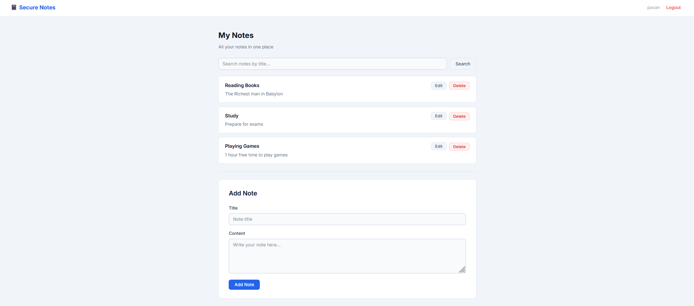
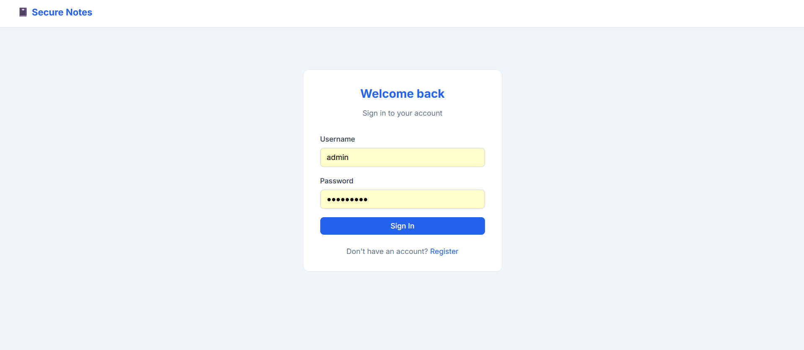
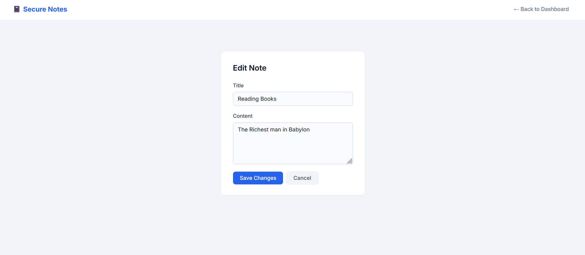
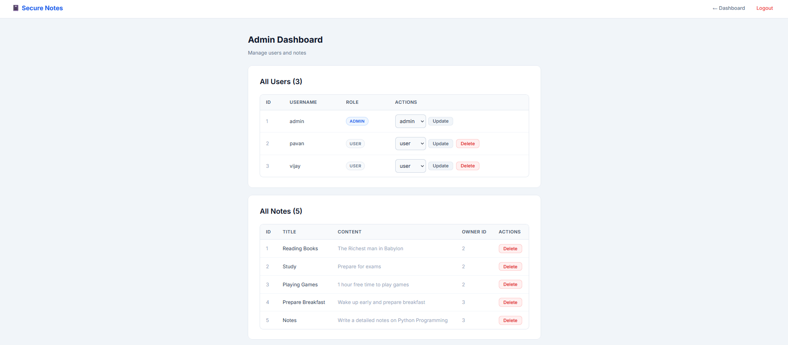

# 📓 Secure Notes

A full-stack **notes application** built with FastAPI, SQLAlchemy, and Jinja2. Supports user authentication with JWT, role-based access control, and a complete admin dashboard.



---

## ✨ Features

- 🔐 **JWT Authentication** — secure login with HTTP-only cookies
- 🔑 **Argon2 Password Hashing** — industry-standard password security
- 👤 **Role-Based Access** — separate user and admin roles
- 📝 **Full Note Management** — create, edit, search, and delete notes
- 🛡️ **Admin Dashboard** — manage all users and notes from a UI
- ✅ **Input Validation** — reusable `Annotated` types with Pydantic v2
- 🎨 **Clean UI** — simple, responsive design with a single CSS file
- 🔒 **Environment-based secrets** — no hardcoded credentials

---

## 📸 Screenshots

### Login Page


### Dashboard


### Edit Note


### Admin Dashboard


---

## 🗂️ Project Structure

```
secure_notes/
│
├── main.py               # App entry point
├── database.py           # SQLAlchemy engine and session
├── models.py             # Database models (User, Note)
├── schemas.py            # Pydantic schemas
├── field_types.py        # Reusable Annotated validation types
├── auth.py               # JWT auth and password hashing
├── crud.py               # Database operations
│
├── routers/
│     ├── auth_router.py  # Login, register, logout
│     ├── note_router.py  # Dashboard, create, edit, delete notes
│     └── admin_router.py # Admin user and note management
│
├── templates/
│     ├── base.html
│     ├── login.html
│     ├── register.html
│     ├── dashboard.html
│     ├── edit_note.html
│     ├── admin_dashboard.html
│     └── 404.html
│
├── static/
│     └── style.css       # Single stylesheet for entire app
│
├── .env                  # Secret keys (never commit this)
├── .gitignore
└── requirements.txt
```

---

## ⚙️ Getting Started

### Prerequisites

- Python 3.9+

### 1. Clone the repository

```bash
git clone https://github.com/your-username/secure-notes.git
cd secure-notes
```

### 2. Create a virtual environment

```bash
python -m venv venv
source venv/bin/activate        # Windows: venv\Scripts\activate
```

### 3. Install dependencies

```bash
pip install -r requirements.txt
```

### 4. Set up your `.env` file

Create a `.env` file in the project root:

```env
SECRET_KEY=your-very-long-random-secret-key-here
ADMIN_PASSWORD=your-secure-admin-password
```

Generate a strong secret key with:

```bash
python -c "import secrets; print(secrets.token_hex(32))"
```

> ⚠️ Never commit your `.env` file to Git. It is already covered by `.gitignore`.

### 5. Run the app

```bash
uvicorn main:app --reload
```

Open: [http://127.0.0.1:8000](http://127.0.0.1:8000)

---

## 🔑 Default Admin Account

On first run, an admin account is automatically created using the credentials from your `.env` file.

```
username: admin
password: (value of ADMIN_PASSWORD in your .env)
```

> ⚠️ Always set a strong `ADMIN_PASSWORD` in your `.env` before running.

---

## 🛣️ Routes

| Method | Route | Description | Access |
|--------|-------|-------------|--------|
| GET | `/` | Redirects to login | Public |
| GET | `/login` | Login page | Public |
| POST | `/login` | Submit login | Public |
| GET | `/register` | Register page | Public |
| POST | `/register` | Submit registration | Public |
| GET | `/logout` | Logout | Authenticated |
| GET | `/dashboard` | View your notes | Authenticated |
| POST | `/notes` | Create a note | Authenticated |
| GET | `/notes/{id}/edit` | Edit note page | Owner only |
| POST | `/notes/{id}/update` | Save note changes | Owner only |
| POST | `/notes/{id}/delete` | Delete a note | Owner only |
| GET | `/admin/dashboard` | Admin UI | Admin only |
| GET | `/admin/users` | List users (JSON) | Admin only |
| POST | `/admin/users/{id}/update` | Update user role | Admin only |
| POST | `/admin/users/{id}/delete` | Delete a user | Admin only |
| GET | `/admin/notes` | List all notes (JSON) | Admin only |
| POST | `/admin/notes/{id}/delete` | Delete any note | Admin only |

---

## 🛠️ Tech Stack

| Technology | Purpose |
|---|---|
| [FastAPI](https://fastapi.tiangolo.com/) | Web framework |
| [SQLAlchemy](https://www.sqlalchemy.org/) | ORM / database layer |
| SQLite | Database (local/dev) |
| [Pydantic v2](https://docs.pydantic.dev/) | Data validation |
| [python-jose](https://github.com/mpdavis/python-jose) | JWT token handling |
| [passlib + argon2](https://passlib.readthedocs.io/) | Password hashing |
| [Jinja2](https://jinja.palletsprojects.com/) | HTML templates |
| [python-dotenv](https://pypi.org/project/python-dotenv/) | Environment variables |

---

## ✅ Validation

Validation is handled using reusable `Annotated` types defined in `field_types.py`:

```python
Username = Annotated[str, Field(min_length=3, max_length=20, pattern=r"^[a-zA-Z0-9_]+$")]
Password = Annotated[str, Field(min_length=8, max_length=100)]
NoteTitle = Annotated[str, Field(min_length=1, max_length=100)]
NoteContent = Annotated[str, Field(max_length=5000)]
```

These types are shared across schemas and routes — change the rule once and it applies everywhere.

---

## ⚠️ Known Limitations

This is a beginner/learning project. Before production use:

- Replace SQLite with PostgreSQL or MySQL
- Set `secure=True` on cookies (requires HTTPS)
- Add CSRF protection
- Add pagination for large datasets
- Pin dependency versions in `requirements.txt`

---

## 📚 What You Can Learn From This Project

- FastAPI project structure with routers
- JWT authentication with HTTP-only cookies
- SQLAlchemy ORM with relationships and cascades
- Role-based access control
- Pydantic v2 validation with `Annotated` types
- Jinja2 templating with template inheritance
- Dependency injection in FastAPI
- Managing secrets with `.env` files
